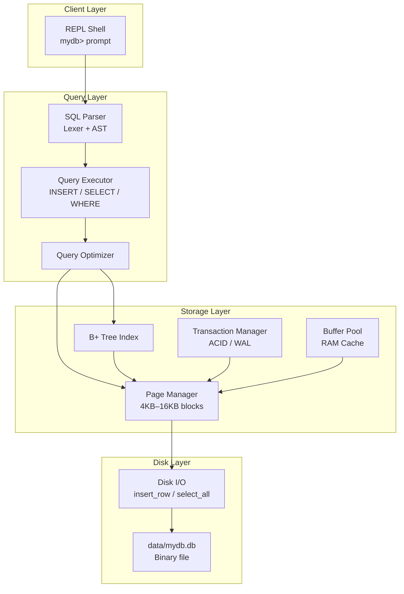
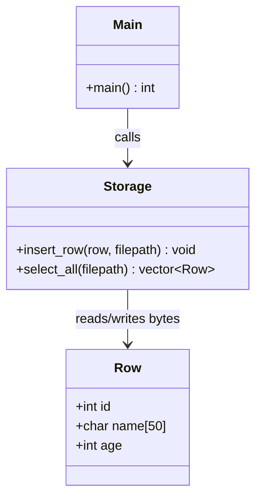
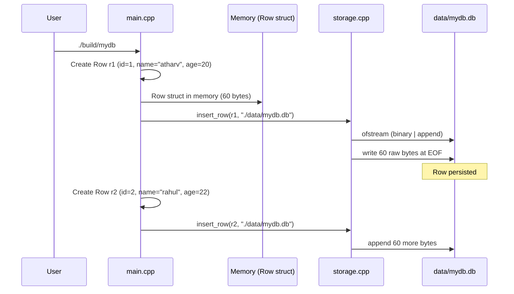
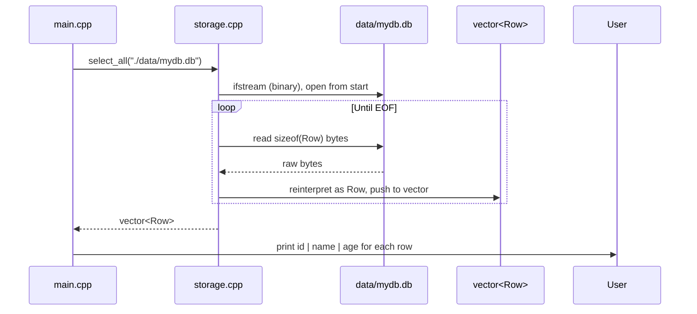
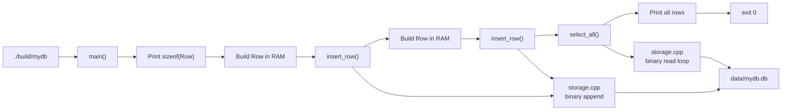
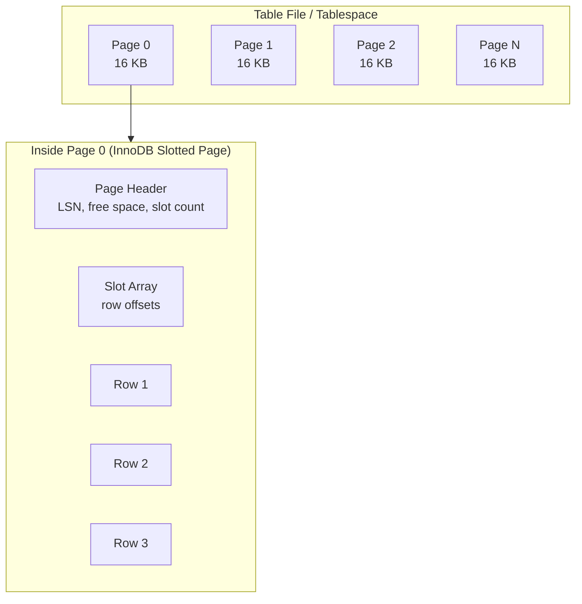
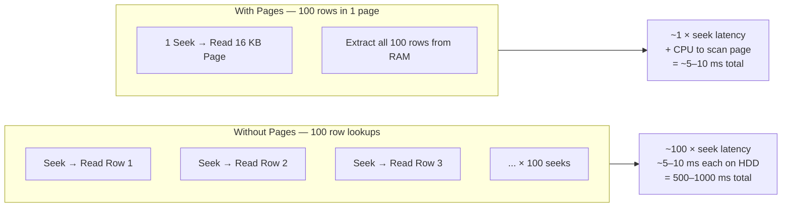
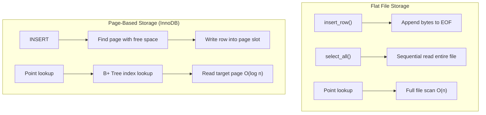

# ForgeDB

**ForgeDB** is a relational database engine written in C++, built from scratch to explore how systems like **MySQL/InnoDB** store data on disk, parse SQL, build indexes, and guarantee durability.

The project is organized as a layered storage engine — disk I/O at the bottom, query processing at the top — following the same architectural patterns used by production databases.

| | |
|---|---|
| **Language** | C++17 |
| **Build** | CMake / g++ |

---

## Table of Contents

- [High-Level Design (HLD)](#high-level-design-hld)
- [Low-Level Design (LLD)](#low-level-design-lld)
- [End-to-End Runtime Flow](#end-to-end-runtime-flow)
- [Disk Layout](#disk-layout)
- [Pages & Disk Seeks](#pages--disk-seeks)
- [Project Structure](#project-structure)
- [Build & Run](#build--run)
- [Architecture Roadmap](#architecture-roadmap)
- [References](#references)

---

## High-Level Design (HLD)

ForgeDB follows a **layered architecture** — the same pattern used by MySQL, PostgreSQL, and SQLite.



### Component Responsibilities

| Layer | Component | Responsibility |
|-------|-----------|----------------|
| Client | REPL | Interactive shell and meta-commands (`.exit`, `.help`) |
| Query | SQL Parser | Tokenize and parse SQL into an AST |
| Query | Executor | Execute INSERT, SELECT, and WHERE against storage |
| Storage | Page Manager | Manage fixed-size pages and slotted row format |
| Storage | B+ Tree Index | O(log n) lookups by key |
| Storage | Transaction Manager | ACID guarantees, WAL, crash recovery |
| Storage | Buffer Pool | Cache hot pages in RAM |
| Disk | Disk I/O | Raw byte read/write to the database file |

---

## Low-Level Design (LLD)

### Module Diagram



### Row Schema

The storage layer uses a fixed-size row format. Each row is a plain C++ struct serialized as raw bytes on disk.

```cpp
struct Row {
    int id;          // 4 bytes
    char name[50];   // 50 bytes (fixed — truncates beyond 50 chars)
    int age;         // 4 bytes
};
// Total: sizeof(Row) = 60 bytes (includes compiler alignment padding)
```

### Storage API

| Function | Input | Output | Disk Operation |
|----------|-------|--------|----------------|
| `insert_row(row, path)` | `Row` struct | void | Append `sizeof(Row)` raw bytes to end of file |
| `select_all(path)` | file path | `vector<Row>` | Read file in `sizeof(Row)` chunks from start to end |

Serialization uses `reinterpret_cast` to copy the in-memory struct directly to disk with no format conversion. This is the simplest possible persistence model and the foundation that higher layers build on.

---

## End-to-End Runtime Flow

### Insert Flow



### Select Flow



### Full Program Flow



---

## Disk Layout

Rows are stored as a **flat, sequential sequence of fixed-size records** — one row immediately after another with no page headers or metadata.

```
data/mydb.db
┌──────────────────────────────────────────────────────────────────────┐
│ Row 0 (60 bytes)          │ Row 1 (60 bytes)          │ Row 2 ...    │
├───────────────────────────┼───────────────────────────┼──────────────┤
│ id=1                      │ id=2                      │              │
│ name="atharv" (50 bytes)  │ name="rahul"  (50 bytes)  │              │
│ age=20                    │ age=22                    │              │
└───────────────────────────┴───────────────────────────┴──────────────┘
  offset 0                    offset 60                   offset 120

Random access:
  Row N is at byte offset = N × sizeof(Row)
  file.seekg(N * sizeof(Row))
```

### Hex Dump Example

```bash
xxd data/mydb.db
```

```
00000000: 0100 0000 6174 6861 7276 ... 1400 0000   ← id=1, "atharv", age=20
0000003c: 0200 0000 7261 6875 6c ... 1600 0000   ← id=2, "rahul",  age=22
```

- `0100 0000` → little-endian integer `1` (id)
- `6174 6861 7276` → ASCII `"atharv"`
- `1400 0000` → little-endian integer `20` (age)

Opening the file in a text editor shows non-printable characters, confirming the data is stored in binary format rather than plain text or CSV.

---

## Pages & Disk Seeks

Production storage engines organize disk data into **pages** rather than writing rows directly to a flat file. Understanding pages and seeks explains why real databases are structured the way they are.

### What is a Page?

A **page** (also called a **block**) is a fixed-size chunk of disk that the storage engine reads or writes as a single unit.



| Engine | Default Page Size | Notes |
|--------|-------------------|-------|
| **InnoDB (MySQL)** | 16 KB | Slotted page format, multiple variable-length rows per page |
| **SQLite** | 4 KB | B-tree pages (leaf vs internal node types) |
| **PostgreSQL** | 8 KB | Heap pages and separate index page files |

**Why pages exist:**

1. **Disk I/O granularity** — The OS and disk hardware operate on blocks (typically 4 KB). Reading one page equals one I/O operation regardless of how many rows are inside.
2. **Buffer pool efficiency** — Cache entire pages in RAM and reuse them without re-reading from disk.
3. **Space management** — Track free space and insert or delete rows within a page without rewriting the whole file.

### What is a Disk Seek?

A **seek** is the physical movement of the disk read/write head to a new location on the platter (HDD), or the latency of accessing a new flash block (SSD).



| Operation | Seek Count (HDD) | Typical Latency |
|-----------|------------------|-----------------|
| Sequential read (full scan) | 0 extra seeks | ~100 MB/s throughput |
| Random read — 1 row, no pages | 1 seek per row | ~5–10 ms per row |
| Random read — 100 rows, no pages | 100 seeks | ~500–1000 ms |
| Random read — 100 rows in 1 page | 1 seek | ~5–10 ms |

> **Key insight:** Random I/O is seek-bound, not bandwidth-bound. Pages amortize seek cost by bundling many rows into a single I/O operation.

### Flat File vs Page-Based Storage



| Aspect | Flat File | Page-Based + Index |
|--------|-----------|-------------------|
| Write | Append to EOF | Insert into page slot |
| Full scan | Read every byte O(n) | Scan all pages O(n) — same complexity, better I/O pattern |
| Point lookup | Full scan O(n) | B+ Tree → one page read O(log n) |
| Seeks per 1000 lookups | ~1000 (worst case) | ~1–3 (index + data page) |
| Space efficiency | Fixed bytes per row | Variable-length rows, less waste |

---

## Project Structure

```
ForgeDB/
├── include/
│   ├── row.h                 # Table schema (Row struct)
│   └── storage.h             # Storage API declarations
├── src/
│   ├── main.cpp              # Entry point
│   └── storage.cpp           # Disk I/O (insert_row, select_all)
├── data/
│   ├── .gitkeep
│   └── mydb.db               # Created at runtime (gitignored)
├── tests/
├── build/                    # Compiled binary (gitignored)
├── CMakeLists.txt
├── LEARNINGS.md              # DB concepts and developer notes
└── README.md
```

---

## Build & Run

### Prerequisites

- C++17 compiler (`g++` or `clang++`)
- CMake 3.10+ (optional)

### Build with g++

```bash
g++ -std=c++17 -Iinclude src/main.cpp src/storage.cpp -o build/mydb
```

### Build with CMake

```bash
mkdir -p build && cd build
cmake ..
cmake --build .
cd ..
```

### Run

```bash
./build/mydb
```

**Expected output:**

```
sizeof(Row) = 60 bytes
1 | atharv | 20
2 | rahul | 22
```

### Verify Binary Persistence

```bash
# Inspect raw bytes on disk
xxd data/mydb.db

# Fresh start (delete existing data)
rm data/mydb.db && ./build/mydb
```

> Running the program multiple times appends rows to the existing file. Delete `data/mydb.db` to start with a clean database.

---

## Architecture Roadmap

The engine is built incrementally, one layer at a time:

| Layer | Feature |
|-------|---------|
| Disk I/O | Row storage on disk — binary file read/write |
| REPL | Interactive shell with `mydb>` prompt |
| SQL Parser | Lexer, tokenizer, and AST generation |
| Query Executor | INSERT, SELECT, WHERE |
| Page Manager | Fixed-size pages and slotted row format |
| B+ Tree Index | O(log n) key lookups |
| Transaction Manager | WAL and basic ACID guarantees |
| Buffer Pool | In-memory page cache |

---

## References

- [Let's Build a Simple Database (cstack/db_tutorial)](https://github.com/cstack/db_tutorial)
- [Database Internals — Alex Petrov (O'Reilly)](https://www.databass.dev/)
- [Designing Data-Intensive Applications — Martin Kleppmann](https://dataintensive.net/)
- [CMU 15-445 Database Systems (Andy Pavlo)](https://www.youtube.com/playlist?list=PLSE8ODhjZXmbZO-avfQ2lUhHbI5Q5vOSm)
- [MySQL InnoDB Architecture](https://dev.mysql.com/doc/refman/8.0/en/innodb-architecture.html)
- [InnoDB Physical Structure](https://dev.mysql.com/doc/refman/8.0/en/innodb-physical-structure.html)

---

## License

Educational project built for learning. See [LEARNINGS.md](./LEARNINGS.md) for detailed database concepts and developer notes.
